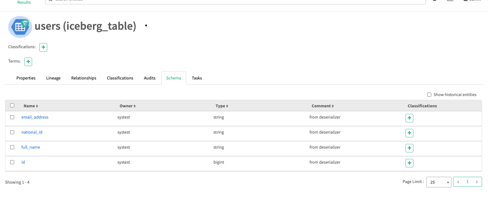
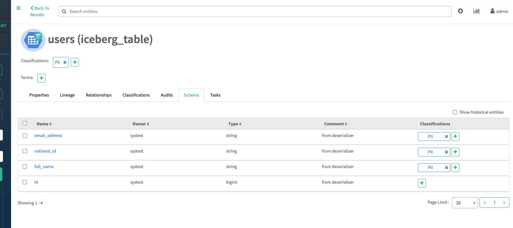

# Enterprise PII Scanner (Iceberg & Apache Atlas)

This solution automates PII discovery using NLP and synchronizes metadata tags to Apache Atlas. This solution is optimized for multi-version Python environments and distributed Spark execution.

📂 Project Structure 

* `driver_env/` - Local virtual environment for the Driver node(Python 3.8).
* `enterprise_pii_scan.py` - Core PySpark logic for PII detection and Atlas tagging.
* `executor_env.zip` - Compressed environment for distributed Spark Executors.
* `pii_rules.json` - Customizable PII regex patterns and logic.
* `run.sh` - Execution wrapper for spark3-submit.
* `setup_env.sh` - Automation script to build the environment.

---

⚙️ Configuration Details

🧊 Iceberg Runtime Jar
The scanner requires the Iceberg-Spark runtime library to interact with Iceberg tables. This is provided via the ICEBERG_JAR in run.sh:
ICEBERG_JAR="/opt/cloudera/parcels/SPARK3-3.3.2.3.3.7190.0-91-1.p0.45265883/lib/spark3/iceberg/iceberg-spark-runtime-3.3_2.12-1.3.0.3.3.7190.0-91.jar"

Note: This path is specific to the current Cloudera Parcel version. If the cluster is upgraded, verify the new path in /opt/cloudera/parcels/SPARK3/lib/spark3/iceberg/.

🐍 Python Version Management
Version:This project requires **Python 3.8**. In environments with multiple Python versions installed, the scripts are configured to explicitly call `/usr/bin/python3.8` to ensure compatibility with Spark 3.3.
Key Dependencies: pandas, pyarrow, spacy (3.7.5), presidio-analyzer, and requests-kerberos.
PyArrow: Required for Spark-Pandas (Arrow) optimization (spark.sql.execution.arrow.pyspark.enabled).

🏆pii_rules.json
Centralized Configuration: All operational parameters, including Atlas URLs and PII detection thresholds, are managed via pii_rules.json. This allows for zero-code changes when moving across environments.
Before running the environment setup, create your local configuration file from the provided template:
cp pii_rules_example.json pii_rules.json
Edit pii_rules.json to include your specific Atlas URL, Kerberos credentials, and custom PII regex patterns.

🚀 Execution Steps

Step 1: Initialize the Environment
Run the setup script to build the local venv and the executor package. This only needs to be run once or when dependencies change.
This project uses a Self-Contained Environment strategy. You do not need to install libraries globally on your cluster nodes.
Run the setup script to build the local virtual environment (driver_env/) and package the executor dependencies (executor_env.zip).
Note: The script will use /usr/bin/python3.8 by default. Please ensure Python 3.8 is installed on your edge node.
chmod +x setup_env.sh
./setup_env.sh

Step 2: Kerberos Authentication
Ensure you have an active ticket before starting the scan
Ranger Permissions
The systest user must have Entity Read and Entity Update permissions in the Ranger Atlas service (cm_atlas).

Step 3: Run the scanner
Navigate to the project directory and execute the wrapper script.
Execute the Spark job. The script handles multi-threading and interacts with Atlas.
chmod +x run.sh
./run.sh

---

## 📊 Usage Demo: Before & After

This section demonstrates the tool's capability to discover and tag PII metadata automatically. We scan an Iceberg table, and the result is synchronized to Apache Atlas.

 

| **1. Before: An Untagged Iceberg Entity in Atlas** | **2. After: Running the PII Scanner** |
| :---: | :---: |
| [Click for Larger View] | [Click for Larger View] |
|  |  |
| **Description:** This screenshot shows an Iceberg table details in Apache Atlas *before* running the scanner. Note that the **Classifications** list is empty, and individual string columns are not marked as PII. | **Description:** The same entity details details page *after* a successful scan. A **"PII"** classification has been automatically applied to the table level, and affected string columns now possess the same PII tag. |

> **Note:** The "after" screenshot clearly demonstrates successful metadata synchronization and policy enforcement.

---
